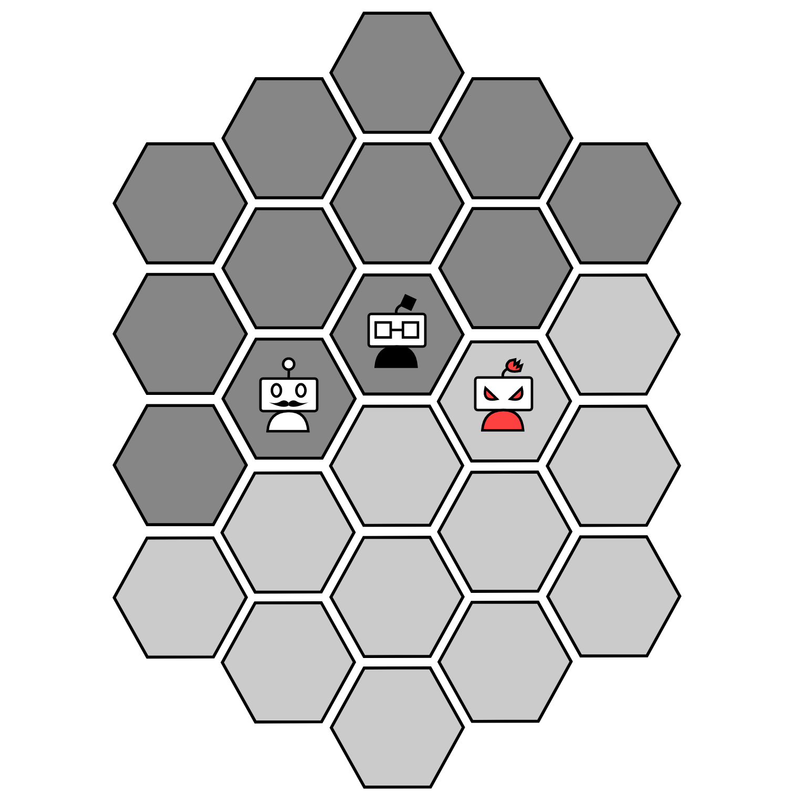

#  Robotory

Robotory is a board game designed in 2006 by Susumu Kawasaki. Try a live demo [here](http://robotory.herokuapp.com).
> It is a tug-of-war for control of three robots using a dwindling common supply of energy.

## Rules


Three robots are on the game board in Robotory. 

When the game starts, the robots are placed in the center of the map, and both players recieve 4 energy pawns:
* 2 Black energy pawns
* 2 White energy pawns


### Player turn
On a turn, a player either
* Places one energy pawn of either color from their personal supply onto the game board
* Takes energy pawns from the global supply
* Moves a robot

### Energy pawns

Placing energy pawns can only be done once every turn, and each player has their own pawn supply. When the player's personal pawn supply depletes, the player can't place energy pawns.

To move, a robot "eats" energy pawns of the appropriate color placed in their path:
* The white robot eats white energy panws
* The black robot eats black energy pawns
* The red robot eats both types of energy pawns

A player may move a robot multiple steps at once, provided that the appropriate pawns are on the way.

On a turn, a player can also take pawns from the global supply, so long as they won't be holding more than 4 pawns at once in their personnal supply.

The global supply contains 10 energy pawns of each color. If the amount of pawns of one color reaches 0 when a player takes pawns from the global supply, the game stops, and the winner is the player with most robots in their area.

## Installation

To install your own version of robotory, clone this repository, and install all the node dependencies.

```
npm install
```
You should be able to start the server with 
```
npm start
```
By default the port is 8080, but you can set it to whatever you want with an environnment variable named `PORT`.